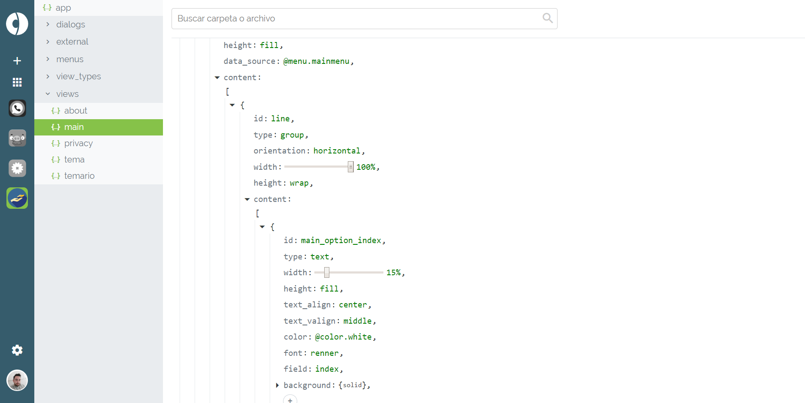

# What is Codoozer?

Codoozer is an online tool for building software without the need of having programming skills. With Codoozer you'll be able to create:

- Android native apps
- iOS native apps (coming soon)
- Websites (not yet available)
- Backend Scripts - PHP (not yet available)
- Cloud Functions for Google Cloud Platform (not yet available)
- Other platforms (not yet available)

Codoozer is not an app builder, but a source code builder. Therefore, each project built with Codoozer will have its own source code, which will be compiled in order to provide the ready-to-install application files.

For using Codoozer, you need to create a Doyo account, registering at [https://codoozer.com](https://codoozer.com)

The way apps are built on Codoozer is based on the edition of JSON files in order to define the user interface, the content and the behavior of the app. JSON files are plain text files where the information is organized on key/value pairs.

In its website, Codoozer provides an assistant for editing these JSON files, making it really easy to edit them and avoiding errors. The next picture shows a screenshot of Codoozer's edition interface:

Altarnatively, Codoozer allows you to build your project from your own computer, in local mode, using any text editor or any IDE.

### Next steps:

- [Getting started](basic_concepts)
- [Building a native mobile app](mobile_app)
