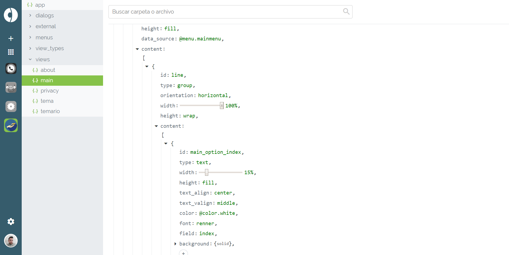

# ¿Qué es Codoozer?

Codoozer es una herramienta online para crear diferentes tipos de aplicaciones de software sin necesidad de disponer de conocimientos de programación. Con Codoozer, se podrá crear:

- Aplicaciones nativas Android
- Aplicaciones nativas iOS (próximamente)
- Páginas web (próximamente)
- Backend Scripts (PHP)
- Cloud Functions para Google Cloud Platform (próximamente)
- Bots AIML (próximamente)

Para cada una de estas plataformas, Codoozer genera el código fuente, además de compilar el proyecto y entregar la app final ejecutable.

Para acceder a Codoozer, es necesario crear una cuenta en [https://codoozer.com](https://codoozer.com)

